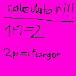

    
    <h1>Caclculator</h1>

calculate

you can do funny stuff like uuuuh i forgor ??! 
u can factorial `3!` or `factorial(3)` or `multifactorial(3, 1)` its all the same
u can also `sqrt(85)` or stuff  

all functions:
- i dont want to lsit them
  

theres also constants like pi its 3.14159
- theres more but i dotn want to lst aagain
       
if u do thing like `(("nuh "("uh "3)-" $")+"\n")20` it print 
nuh uh uh uh 
nuh uh uh uh 
nuh uh uh uh 
nuh uh uh uh 
nuh uh uh uh 
nuh uh uh uh 
nuh uh uh uh 
nuh uh uh uh 
nuh uh uh uh 
nuh uh uh uh 
nuh uh uh uh 
nuh uh uh uh 
nuh uh uh uh 
nuh uh uh uh 
nuh uh uh uh 
nuh uh uh uh 
nuh uh uh uh 
nuh uh uh uh 
nuh uh uh uh 
nuh uh uh uh 
^ more complicated version for that is `((charCode(110, 117, 104)" "((charCode(117,104)" ")3charCode(10))20).replace(Regex(charCode(10)+"$"), "")`